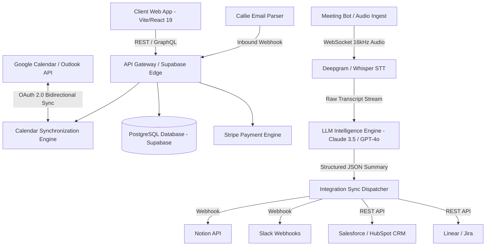

# Product Requirements Document (PRD)
# Product: elev — The AI-Native Meeting Operating System

**Document Version:** 2.0.0 (Comprehensive Master Specification)  
**Status:** Approved for Implementation  
**Product Owner:** elev Product & Engineering Team  
**Domain:** AI Scheduling, Meeting Intelligence, Autonomous Executive Assistance & Creator Monitization  

---

## 1. Executive Summary & Vision

### 1.1 The Vision
**elev** is not just another booking link—it is an **AI-Native Meeting Operating System** designed to eliminate 100% of the cognitive overhead, calendar gridlocks, and administrative burdens associated with business conversations. While legacy platforms (Calendly, Doodle, Acuity) act merely as passive digital appointment books, elev handles the **entire end-to-end lifecycle of every meeting**:
- **Before the Meeting**: Instant routing, buffer protection, and autonomous multi-turn email coordination via **Callie AI**.
- **During the Meeting**: Invisible transcription, speaker diarization, and live context retrieval via **elev Notetaker**.
- **After the Meeting**: Instant action item extraction, Notion/Slack/CRM sync, follow-up draft emails, and video timeline anchors.
- **For Paid Engagements**: Upfront escrow deposits, paid consultation slots, and prepaid retainer hour packs via **elev Pay**.

### 1.2 Problem Statement
Modern knowledge workers, founders, sales teams, and consultants face four acute meeting pain points:
1. **The Scheduling Ping-Pong**: Knowledge workers spend an average of **4.8 hours per week** just negotiating meeting times across timezones, checking calendars, and sending passive links that often feel impolite to VIP clients.
2. **Calendar Fragmentation & Burnout**: Back-to-back scheduling leads to cognitive exhaustion, missed prep time, and zero buffer space between high-stakes calls.
3. **The Post-Meeting Black Hole**: Over 65% of meeting action items are lost or delayed because attendees scramble to take notes rather than engaging in the conversation, resulting in an estimated $37B in annual lost productivity across US enterprises.
4. **Unpaid No-Shows & Chased Invoices**: Independent advisors and specialized consultants lose 18–25% of their billable potential to late cancellations, no-shows, and manual invoicing cycles.

### 1.3 Solution Statement
elev solves this by bundling four deep pillars into a cohesive platform:
- **elev Schedule**: Intelligent routing, collective team availability, and custom calendar booking links.
- **elev Callie**: Autonomous AI email agent (`callie@elev.ai`) that coordinates meetings directly in email threads with natural human cadence.
- **elev Notetaker**: Automated meeting joiner that provides real-time multi-speaker transcription, bulleted decisions, and direct sync into project management tools.
- **elev Pay**: Zero-friction upfront payment capture and multi-session hourly retainer escrow via Stripe Connect.

### 1.4 Core Success Metrics & Target KPIs
| Metric | Baseline (Legacy Tools) | elev Target (v1.0) | Measurement Method |
| :--- | :--- | :--- | :--- |
| **Weekly Admin Time Saved** | 0.5 hours | **>= 4.5 hours / user** | Telemetry tracking time spent on scheduling & notes |
| **Callie Autonomous Resolution**| 0% (Manual) | **>= 92.5%** | Percentage of email threads booked without human override |
| **Meeting Show-Up Rate** | 76% | **>= 93.8%** | Ratio of confirmed events to attended events |
| **Action Item Completion Sync**| 32% (Manual notes) | **>= 88%** | Percentage of extracted tasks synced to Notion/Linear/Slack |
| **Inbound Lead-to-Meeting Speed**| 4.2 hours | **< 45 seconds** | Time from form submission to confirmed calendar booking |
| **Landing Page Visitor-to-Signup**| 2.8% | **>= 8.2%** | Google Analytics / PostHog conversion funnel |

---

## 2. Target Personas & User Journeys

### 2.1 User Personas

#### Persona A: Sarah — High-Volume Enterprise Account Executive (AE)
- **Profile**: Closes $20k–$100k B2B SaaS deals. Receives 15–30 inbound leads per week.
- **Pain Points**: Inbound leads drop off if not booked within 5 minutes. Spends 45 minutes every evening manually logging call notes and action items into Salesforce.
- **Core elev Feature**: Routing Forms + Notetaker CRM Auto-Sync.

#### Persona B: David — Tech Founder & CEO
- **Profile**: Manages investor relations, hiring panels, and internal strategy across 3 different timezones.
- **Pain Points**: Calendar is overrun with back-to-back calls; zero time to eat or prepare. Sending a Calendly link to a Tier-1 VC feels transactional and impersonal.
- **Core elev Feature**: Callie AI (`cc callie@elev.ai`) + Dynamic Buffer Guards.

#### Persona C: Elena — Independent Management Consultant / Executive Coach
- **Profile**: Bills $350–$600/hour for 1-on-1 strategy sessions.
- **Pain Points**: Clients book time and cancel last minute. Spends hours chasing unpaid invoices and sending recap summaries.
- **Core elev Feature**: elev Pay (Upfront Stripe Hold) + Automated Post-Call Recaps.

#### Persona D: Marcus — Lead Technical Recruiter
- **Profile**: Schedules 4-stage interview loops involving candidates and 3 engineering team members.
- **Pain Points**: Coordinating panel availability across 4 busy engineering leads takes 3 to 5 days of calendar cross-checking.
- **Core elev Feature**: Collective Round-Robin Scheduling + Smart Multi-Host Overlay.

---

### 2.2 End-to-End User Journey Map

```
┌────────────────────────────────────────────────────────────────────────────────────────┐
│                                 THE ELEV LIFECYCLE                                     │
└────────────────────────────────────────────────────────────────────────────────────────┘
  1. INBOUND / DISCOVERY
     ├── Option A: Prospect visits elev.ai/sarah/demo (Interactive custom slug)
     ├── Option B: Form submitted on corporate site (Routed to best AE in <1.2s)
     └── Option C: User CCs callie@elev.ai in an email thread with client
               │
               ▼
  2. AUTONOMOUS SCHEDULING & BUFFER PROTECTION
     ├── Live calendar sync checks Google Calendar & Outlook 365
     ├── Dynamic buffer applied (+15m pre/post buffer reserved automatically)
     ├── If Paid: Credit card authorized via Stripe Elements before slot is locked
     └── Instant ICS / Google Meet / Zoom link dispatched to all attendees
               │
               ▼
  3. THE CALL (ELEV NOTETAKER ACTIVE)
     ├── elev Notetaker bot joins Zoom / Google Meet / MS Teams invisibly
     ├── Deepgram Nova-2 + Whisper streaming speech-to-text with diarization
     └── Real-time audio processing with zero participant latency
               │
               ▼
  4. POST-MEETING AUTOMATION (< 90 SECONDS)
     ├── TL;DR Executive Summary generated (Key decisions, sentiment, highlights)
     ├── Action items assigned with due dates (e.g., "@Elena: Send NDA by Friday")
     ├── Automated sync to Notion database, Slack channel, and Salesforce/HubSpot
     └── Follow-up recap email drafted and queued for 1-click send
```

---

## 3. Detailed Product Pillars & Functional Specifications

### Pillar 1: elev Schedule (Smart Booking & Routing Engine)

#### 1.1 Custom Booking Pages & Availability Logic
- **Custom Slugs**: Every user gets a personalized workspace URL (e.g., `elev.ai/username` or `elev.ai/org/team-sales`).
- **Flexible Event Types**:
  - `1-on-1`: Direct one-on-one booking with configurable durations (15m, 30m, 45m, 60m).
  - `Collective`: Requires ALL selected team members to be free simultaneously.
  - `Round-Robin`: Distributes bookings across team members based on least-recently-booked or equal weight distribution.
  - `Group / Webinar`: Allows multiple invitees to book the same time slot up to a defined seat limit.
- **Dynamic Buffer System**:
  - Configurable pre-meeting buffer (e.g., 10 mins) and post-meeting buffer (e.g., 15 mins).
  - Maximum daily meeting cap (e.g., max 4 hours of meetings per day; automatically blocks remaining slots).
  - Minimum scheduling notice (e.g., no bookings within 4 hours of current time).

#### 1.2 Routing Forms & Lead Qualification
- Embeddable multi-step qualification forms on customer landing pages.
- Logic rules: Route based on company size, geography, annual spend, or custom CRM fields.
- Direct-to-Calendar booking upon qualification; fallback to asynchronous message if unqualified.

---

### Pillar 2: elev Callie (Autonomous AI Email & Chat Assistant)

#### 2.1 Email Ingestion & Natural Language Parser
- **Trigger**: CCing or BCCing `callie@elev.ai` on any email thread.
- **Context Parsing**:
  - Identifies preferred day ranges (e.g., *"early next week"* -> Monday/Tuesday).
  - Identifies duration and meeting type (*"quick 20m catch-up"* vs *"1-hour deep dive"*).
  - Detects location context (auto-proposes Zoom/Meet if remote; physical address if in-person).
- **Calendar Availability Query**:
  - Live query against user’s active Google Calendar / Outlook tokens.
  - Respects VIP client preferences (can offer reserved "VIP only" blocks).

#### 2.2 Autonomous Multi-Turn Negotiation
- Callie replies in the email thread using polished, executive tone:
  > *"Hi Marcus, I'm Callie, David's AI scheduling assistant. Looking at David's calendar, here are 3 options that work best (all times in PT):*
  > *1. Tuesday, Oct 14 at 2:00 PM – 2:30 PM*
  > *2. Wednesday, Oct 15 at 10:30 AM – 11:00 AM*
  > *3. Thursday, Oct 16 at 4:00 PM – 4:30 PM*
  > *Let me know if one of these suits you, or feel free to suggest an alternative!"*
- **Confirmation & Dispatch**:
  - When counterparty chooses a time, Callie books the calendar event, attaches video conferencing details, sends calendar invites, and sends a final confirmation email.
- **Safety Escalation**: If ambiguity exceeds 2 rounds of turns, Callie prompts the human user with a 1-click notification: *"Need your decision on this slot."*

---

### Pillar 3: elev Notetaker (Real-Time Intelligence & Synced Recaps)

#### 3.1 Meeting Capture Engine
- Supports Google Meet, Zoom, and Microsoft Teams.
- **Join Modes**:
  - *Automatic*: Joins any calendar event with a meeting link on the user's schedule.
  - *On-Demand*: Add `notetaker@elev.ai` to an active meeting invite or paste meeting link.
  - *Local Native Recorder*: Native audio capture from Mac/Windows system audio (bypassing the need for a visible bot in enterprise calls).

#### 3.2 Real-Time Speech Processing & Diarization
- **Audio Stream Ingestion**: 16kHz audio stream sent via WebSockets.
- **Speech-to-Text**: Deepgram Nova-2 / Whisper Large v3 with domain-specific vocabulary boost (tech jargon, company names, acronyms).
- **Speaker Diarization**: Multi-speaker attribution (Speaker 0, Speaker 1) resolved to real attendee names via calendar attendee metadata.

#### 3.3 Post-Meeting Summary Generation (< 90 Seconds)
- **Executive TL;DR**: 3 high-impact summary bullets.
- **Decisions Log**: Explicit list of agreements formed during the discussion.
- **Action Items Matrix**:
  - Action item title
  - Assigned owner (`@Name`)
  - Detected deadline
  - Linked video timestamp (e.g., jump directly to 14:32 in the recording).

#### 3.4 2-Way Workflow Sync
- **Notion**: Automatically creates a page in the user's specified Meeting Notes database.
- **Slack**: Posts the summary and action checklist into a designated private/team channel.
- **HubSpot / Salesforce**: Appends call notes and transcripts directly to the matching Contact and Deal record.
- **Linear / Jira**: 1-click conversion of action items into tracked software engineering tickets.

---

### Pillar 4: elev Pay (Paid Meetings, Retainers & Escrow)

#### 4.1 Upfront Payment Protection
- Integrated with Stripe Connect.
- Allows hosts to monetize consultations, advising sessions, coaching calls, and legal intake.
- Payment held in escrow during booking; charged automatically upon meeting start or confirmed schedule.

#### 4.2 Prepaid Retainer Hour Packs
- Clients can purchase 5-hour, 10-hour, or 20-hour retainer packs.
- Calendar dynamically deducts booked minutes from the client's remaining prepaid credit balance.
- Automated balance alert emails when retainer drops below 60 minutes.

#### 4.3 Cancellation & No-Show Safeguards
- Host-configured cancellation policies:
  - *Strict*: Non-refundable if cancelled within 24 hours.
  - *Moderate*: 50% refund if cancelled within 12 hours.
  - *Flexible*: Full refund up to 2 hours before the call.
- Automatic no-show penalty fee billing.

---

## 4. Technical Specifications & Architecture

### 4.1 System Architecture Diagram



### 4.2 Database Schema (PostgreSQL DDL Reference)

```sql
-- 1. Users & Organizations
CREATE TABLE users (
    id UUID PRIMARY KEY DEFAULT gen_random_uuid(),
    email VARCHAR(255) UNIQUE NOT NULL,
    full_name VARCHAR(100) NOT NULL,
    slug VARCHAR(50) UNIQUE NOT NULL,
    avatar_url TEXT,
    timezone VARCHAR(50) DEFAULT 'UTC',
    created_at TIMESTAMPTZ DEFAULT NOW(),
    updated_at TIMESTAMPTZ DEFAULT NOW()
);

-- 2. Connected Calendars
CREATE TABLE connected_accounts (
    id UUID PRIMARY KEY DEFAULT gen_random_uuid(),
    user_id UUID REFERENCES users(id) ON DELETE CASCADE,
    provider VARCHAR(30) NOT NULL, -- 'google' | 'microsoft'
    access_token TEXT NOT NULL,
    refresh_token TEXT NOT NULL,
    token_expires_at TIMESTAMPTZ NOT NULL,
    calendar_id VARCHAR(255),
    is_primary BOOLEAN DEFAULT FALSE
);

-- 3. Event Types (Booking Configurations)
CREATE TABLE event_types (
    id UUID PRIMARY KEY DEFAULT gen_random_uuid(),
    user_id UUID REFERENCES users(id) ON DELETE CASCADE,
    title VARCHAR(150) NOT NULL,
    slug VARCHAR(80) NOT NULL,
    duration_minutes INT NOT NULL DEFAULT 30,
    buffer_before_minutes INT DEFAULT 10,
    buffer_after_minutes INT DEFAULT 15,
    max_daily_limit INT DEFAULT 6,
    is_paid BOOLEAN DEFAULT FALSE,
    price_cents INT DEFAULT 0,
    currency VARCHAR(3) DEFAULT 'USD',
    is_active BOOLEAN DEFAULT TRUE,
    UNIQUE(user_id, slug)
);

-- 4. Confirmed Bookings
CREATE TABLE bookings (
    id UUID PRIMARY KEY DEFAULT gen_random_uuid(),
    event_type_id UUID REFERENCES event_types(id),
    host_user_id UUID REFERENCES users(id),
    invitee_name VARCHAR(100) NOT NULL,
    invitee_email VARCHAR(255) NOT NULL,
    start_time TIMESTAMPTZ NOT NULL,
    end_time TIMESTAMPTZ NOT NULL,
    meeting_url TEXT,
    meeting_platform VARCHAR(30), -- 'google_meet' | 'zoom' | 'teams'
    status VARCHAR(30) DEFAULT 'confirmed', -- 'confirmed' | 'cancelled' | 'completed' | 'no_show'
    payment_status VARCHAR(30) DEFAULT 'unpaid', -- 'authorized' | 'captured' | 'refunded'
    stripe_payment_intent_id VARCHAR(255),
    created_at TIMESTAMPTZ DEFAULT NOW()
);

-- 5. Callie AI Email Threads
CREATE TABLE callie_threads (
    id UUID PRIMARY KEY DEFAULT gen_random_uuid(),
    user_id UUID REFERENCES users(id),
    thread_id VARCHAR(255) NOT NULL,
    sender_email VARCHAR(255) NOT NULL,
    state VARCHAR(50) DEFAULT 'parsing', -- 'proposing' | 'awaiting_reply' | 'confirmed' | 'escalated'
    negotiated_booking_id UUID REFERENCES bookings(id),
    raw_message_log JSONB DEFAULT '[]'::jsonb,
    updated_at TIMESTAMPTZ DEFAULT NOW()
);

-- 6. Meeting Recaps & Notetaker Intelligence
CREATE TABLE meeting_summaries (
    id UUID PRIMARY KEY DEFAULT gen_random_uuid(),
    booking_id UUID REFERENCES bookings(id) ON DELETE SET NULL,
    host_user_id UUID REFERENCES users(id),
    audio_duration_seconds INT,
    tldr_summary TEXT[],
    decisions TEXT[],
    action_items JSONB DEFAULT '[]'::jsonb, -- [{task: "", assignee: "", deadline: "", status: "pending"}]
    transcript_url TEXT,
    video_recording_url TEXT,
    synced_to_notion BOOLEAN DEFAULT FALSE,
    synced_to_slack BOOLEAN DEFAULT FALSE,
    created_at TIMESTAMPTZ DEFAULT NOW()
);
```

### 4.3 Security, Privacy & Enterprise Compliance
- **SOC 2 Type II Certified Process**: Regular third-party penetration testing and end-to-end vulnerability scanning.
- **Zero AI Training Guarantee**: Explicit enterprise contract clauses guaranteeing that customer meeting transcripts, voice recordings, and emails are never used to train OpenAI, Anthropic, or proprietary foundational models.
- **Granular Audio Retention Controls**: Admins can set auto-deletion policies for raw audio recordings (e.g., purge after 7, 30, or 90 days) while retaining the structured action item metadata.
- **HIPAA & GDPR Compliance**: BAA (Business Associate Agreement) available for healthcare organizations; EU data residency option for customer data stored within European AWS/GCP regions.

---

## 5. Monetization Strategy & Packaging

| Feature | Starter (Free) | Pro ($15/mo) | Team ($29/user/mo) | Enterprise (Custom) |
| :--- | :--- | :--- | :--- | :--- |
| **Booking Links** | 1 Active Link | Unlimited | Unlimited | Unlimited |
| **Calendar Sync** | 1 Calendar | Up to 6 Calendars | Unlimited | Unlimited |
| **Callie AI Assistant** | — | 30 email bookings/mo | Unlimited email bookings | Dedicated custom LLM fine-tune |
| **elev Notetaker** | 3 meetings / mo | 25 meetings / mo | Unlimited meetings | Unlimited + Local zero-bot recorder |
| **elev Pay** | 2.5% transaction fee | 1.0% fee | 0% fee (Direct Stripe) | Custom volume pricing |
| **Integrations** | Google, Outlook | + Slack, Notion, Zoom | + Salesforce, HubSpot, Linear | Custom API + Webhook priority queue |
| **Admin & Security** | Standard | Standard | Team Analytics & Shared Queues | SSO (SAML/Okta), SCIM, Audit Logs |

---

## 6. Landing Page Product Alignment (The 5-Card Bento Grid)

To communicate this comprehensive product narrative to prospective customers without falling into generic placeholder fluff, **Section 1 (`MultiProductHero.tsx`)** is mapped 1:1 to elev's real capabilities:

1. **Top Left Card (Capacity & Time Saved)**:
   - *Visual*: 3D Cobalt topographic capacity wave + floating priority pill.
   - *Copy*: `Meeting hours that save themselves` • `332 hrs team coordination time saved this month`.
   - *Pill*: `Executive Strategy • 30m • +18.4 hrs/mo saved • High Priority`.
2. **Top Right Card (Callie AI Precision)**:
   - *Visual*: Electric Blue `#0055FF` background, pulsing sonar radar rings, rotating radar scan beam, and floating center 3D elev squircle app tile.
   - *Copy*: `Decisions in seconds, not weeks of email chains`.
   - *Metric*: `99.4% Autonomous Callie Scheduling Precision` (Zero double-bookings).
3. **Bottom Left Card (Notetaker Follow-up Automation)**:
   - *Visual*: macOS browser window (`elev.ai/notetaker`) with auto-checking checklist and animated gliding cursor pointer.
   - *Tasks*: `✓ Sync action items to Notion & Slack (Elena assigned)` + `○ Send Google Meet recap with video timestamps (1.4s post-call)`.
4. **Bottom Center Card (Smart VIP Scheduling)**:
   - *Visual*: Layered card depth with active 1-click booking preview for Sarah Connor (Linear).
   - *Copy*: `Smart scheduling that adapts to VIP participants` • `Tomorrow at 2:00 PM • Buffer +15m` with interactive `Confirm Slot` button.
5. **Bottom Right Card (Meeting Stack Integration Nexus)**:
   - *Visual*: 4x3 frosted matrix of the 12 core meeting ecosystem apps (Google Calendar, Outlook 365, Zoom, Meet, Slack, Notion, Stripe, Linear, HubSpot, Salesforce, Teams, Zapier) anchored by a floating central elev connector.
   - *Copy*: `One connection to your entire meeting stack`.

---

## 7. Delivery Roadmap & Phased Milestones

### Phase 1: Foundation & Presentation Excellence (Current Milestone)
- [x] Complete luxury design system with wide editorial typography and Anova-grade bento aesthetics.
- [x] MultiProductHero 5-Card Bento Grid aligned 100% with elev meeting platform capabilities.
- [x] Full interactive modals for Demo Request and Authentication (Login/Signup).
- [x] Automated loop animations and tactile micro-interactions (`active:scale-[0.96]`).

### Phase 2: Live Integration Alpha (Q4 2026)
- [ ] OAuth 2.0 direct integration for Google Calendar and Microsoft Graph.
- [ ] Inbound webhook parser for `callie@elev.ai` with Anthropic Claude 3.5 Sonnet agent prompt loop.
- [ ] Real-time availability calculation engine with buffer constraint solver.

### Phase 3: Meeting Intelligence & Audio Pipeline (Q1 2027)
- [ ] Deepgram Nova-2 streaming transcription integration for Zoom and Google Meet bots.
- [ ] Automated action item extraction engine with JSON schema validation.
- [ ] Direct push connectors for Notion databases and Slack incoming webhooks.
- [ ] Stripe Connect escrow engine for elev Pay.

### Phase 4: Enterprise Scale & GA (Q2 2027)
- [ ] SAML 2.0 / Okta SSO and SCIM directory provisioning.
- [ ] Native macOS/Windows menu bar app for local zero-bot meeting recording.
- [ ] Vector search across historical meeting transcripts for instant team recall.
